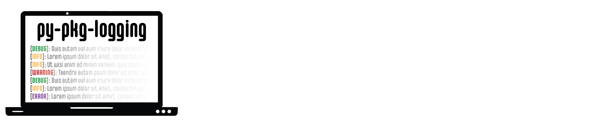
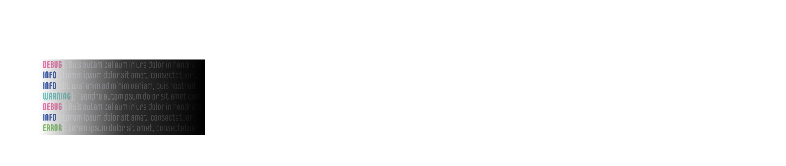

.. title:: py-pkg-logging

.. raw:: html

    <embed>
        

         
         
        

    </embed>

.. raw:: html

    <embed>
        

         
         
         
         
        

    </embed>

    

.. toctree::
   :hidden:
   
   quickstart
   install
   api
   examples

.. grid:: 4
    :gutter: 1    

    .. grid-item-card::
       :link: quickstart.rst
       :text-align: right
       :img-background: _static/magnifying_glass.faded.png
       
       Quickstart
       ^^^
       
       .. raw:: html

          <embed>
 
</embed>

       :octicon:`flame;4em;sd-text-dark`

       
    .. grid-item-card::
       :link: install.rst
       :text-align: right
       :img-background: _static/magnifying_glass.faded.png
       
       Installation
       ^^^
       
       .. raw:: html

          <embed>
 
</embed>

       :octicon:`desktop-download;4em;sd-text-dark`
    
    .. grid-item-card::
       :link: api.rst
       :text-align: right
       :img-background: _static/magnifying_glass.faded.png
       
       API Reference
       ^^^
       
       .. raw:: html

          <embed>
 
</embed>

       :octicon:`code;4em;sd-text-dark`
       
    .. grid-item-card::
       :link: examples.rst
       :text-align: right
       :img-background: _static/magnifying_glass.faded.png
       
       Examples
       ^^^
       
       .. raw:: html

          <embed>
 
</embed>

       :octicon:`sidebar-expand;4em;sd-text-dark`

.. raw:: html

    <embed>
        

          
          
        

    </embed>
